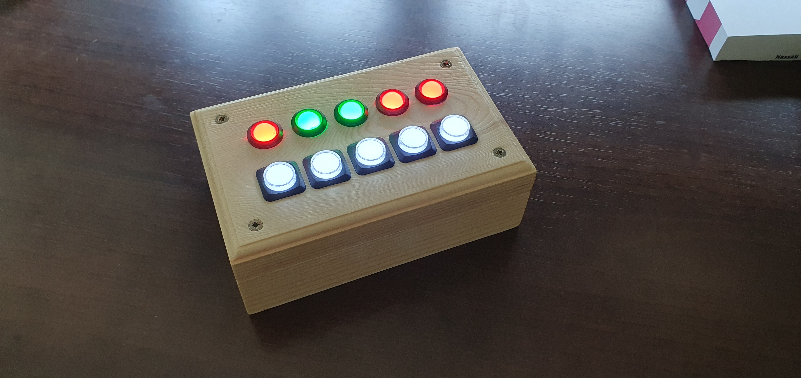
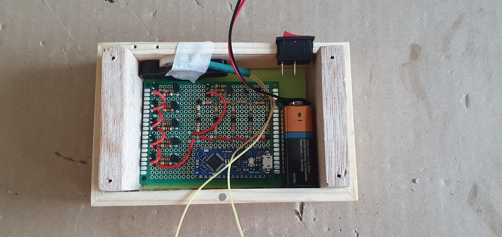
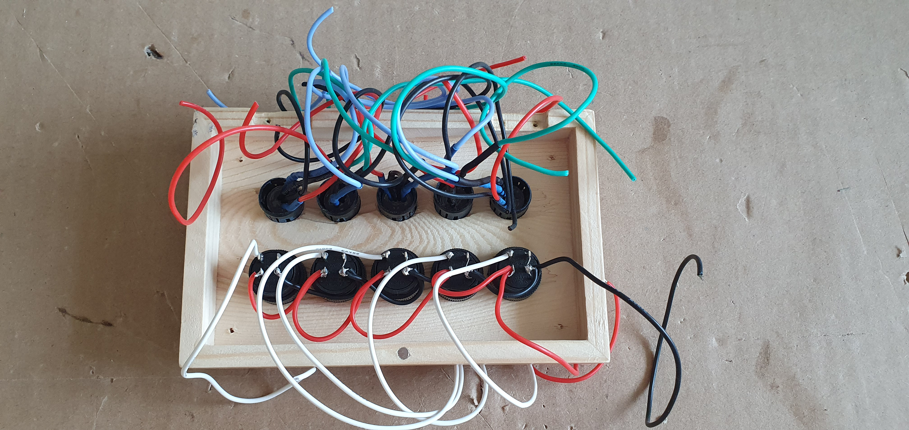
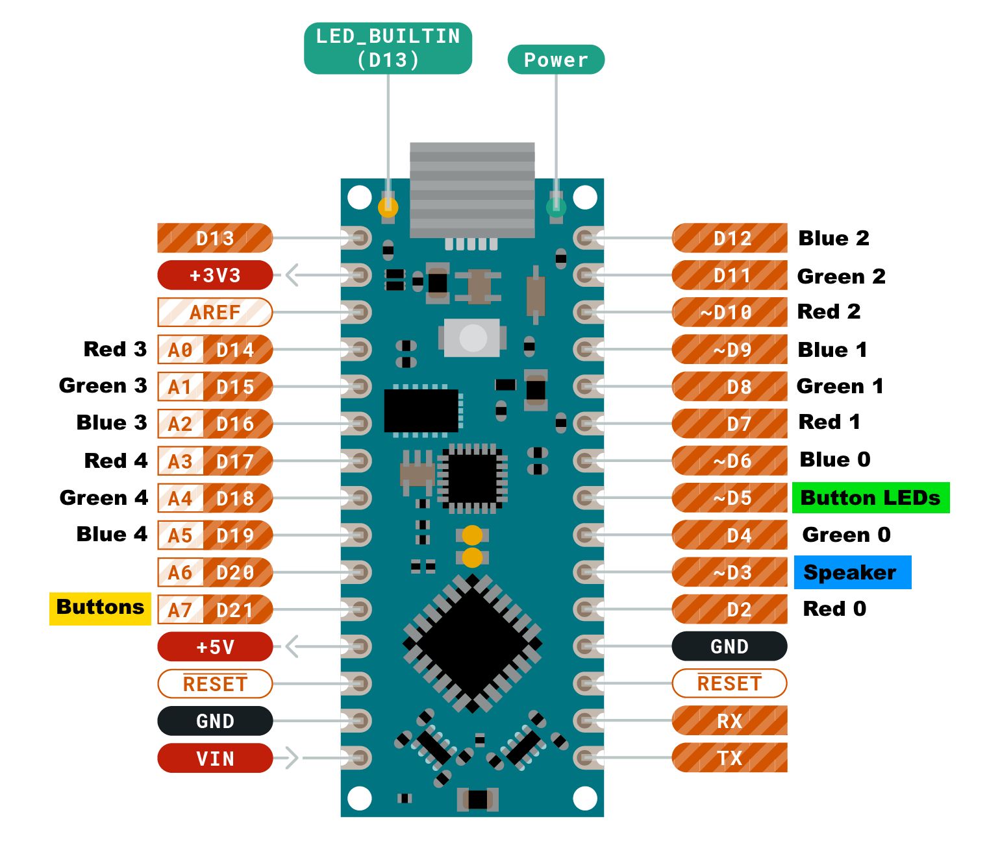
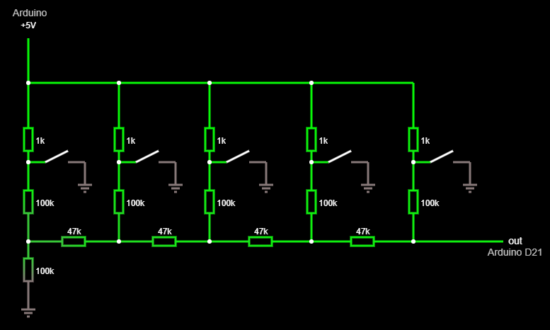
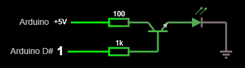

# Button Toy
Toy with buttons and LEDs that plays music upon solving puzzles.

The toy is made with an [Arduino Nano Every](https://docs.arduino.cc/hardware/nano-every) and contains 5 RGB LEDs (10mm),
5 push buttons and a small speaker. Different puzzles can be coded into the Arduino. Pressing the buttons change the lights
in some logic way. When you get all lights to turn green the toy plays a music tune.

## Electronics
The Arduino is powered by a 9V battery. The 5 RGB LEDs are all individually connected to 15 digital output pins of the Arduino
(it has a total of 20). The speaker also takes 1 digital output pin. I use pin D3 for the speaker, because the tone() function
in Arduino [disables PWM on that pin anyway](https://emalliab.wordpress.com/2022/01/23/arduino-nano-every-timers-and-pwm).

There are not enough pins left to connect the push buttons individually to digital inputs, so I made an R-2R DAC for the
push buttons and read the DAC output on an analog pin (D21). The software decodes the analog input back to individual
button presses.

The brightness of the RGB LEDs slightly differs for each Red, Green and Blue component and I like each component to be roughly
the same brightness. So I need a different resistor value for each LED component. For the red LED I use a 100 ohm resistor and
this causes the LED to draw about 30mA current. This is an acceptable high limit for the LED but not acceptable for the Arduino
from which you should pull no more than 20mA per digital output pin. For each red LED, I use a transistor to amplify the current
and with a 1k ohm resistor on the digital pin, I only draw about 2.4mA.

The push buttons also have white LEDs inside them and I just wire these together to one digital output pin on the Arduino (with
PWM support, so I can fade them). I can turn these on when user input is expected and off when no user input is
possible. Because these together draw more than 300mA they also need to be fed through a transistor, same as described above.

## Software
The software is designed as a state machine, where each puzzle is a state and there is a "reward" state which plays an
animation and melody. Everything is coded in a non-blocking manner, such that different processes can operate simultaneously.
For example, a state can continue to change LED colors while a melody is playing. In the main loop, the different systems
are called with an Update() function in which they do their work, but do not block the application. The use of delay() is not
allowed and everything is done through custom timers (read millis() and compare).

The logic which decodes the analog button input is in Buttons.cpp. It continuously reads the voltage on pin D21.
Each time, it first checks if the read value is higher than the value associated with the most significant button (the button which adds the highest voltage) and,
if so, subtracts that button's value from the read value and continues with the next button. This way (if the R-2R DAC is designed correctly) you can detect any
combination of buttons pressed together simultaneously. There is also some timing logic which takes care of debouncing and voltage (measurement) fluctuations.
